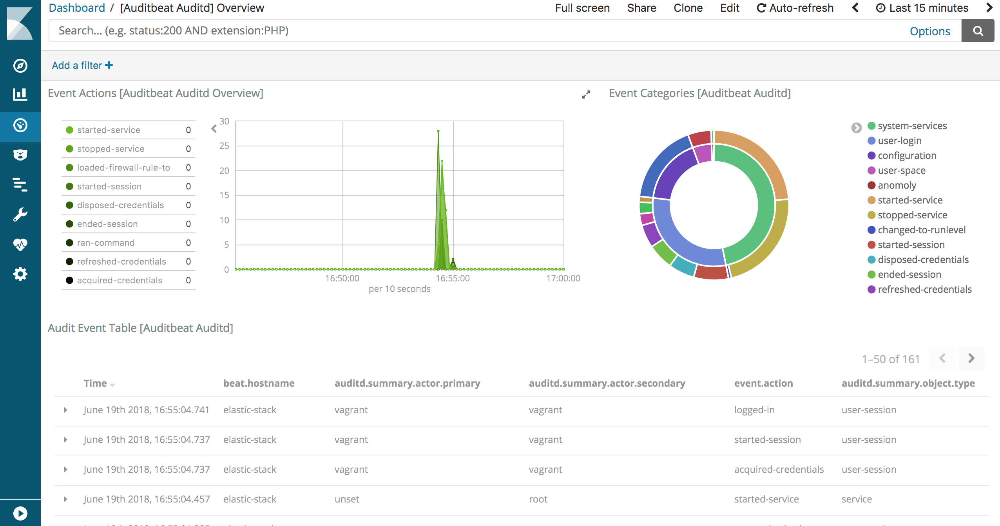

# Elastic Stack 5.1

This repository will install the [Elastic Stack](https://www.elastic.co/products) (Elasticsearch, Logstash, Kibana, and Beats) and optionally X-Pack with a simple `vagrant up` by using [Vagrant](https://www.vagrantup.com)'s [Ansible provisioner](https://www.vagrantup.com/docs/provisioning/ansible.html). All you need is a working [Vagrant installation](https://www.vagrantup.com/docs/installation/) 1.8.6+ and 2.5GB of RAM.




## Configure the Elastic Stack with Ansible

With the [Ansible playbooks](https://docs.ansible.com/ansible/playbooks.html) in the */elastic-stack/* folder you can configure the whole system step by step. Just run them in the given order inside the Vagrant box:

```
> vagrant ssh
$ ansible-playbook /elastic-stack/1_configure-elasticsearch.yml
$ ansible-playbook /elastic-stack/2_configure-kibana.yml
$ ansible-playbook /elastic-stack/3_configure-logstash.yml
$ ansible-playbook /elastic-stack/4_configure-filebeat.yml
$ ansible-playbook /elastic-stack/4_configure-metricbeat.yml
$ ansible-playbook /elastic-stack/4_configure-packetbeat.yml
$ ansible-playbook /elastic-stack/5_configure-dashboards.yml
$ ansible-playbook /elastic-stack/6_add-xpack.yml
```

Or if you are in a hurry, run all playbooks with `/elastic-stack/all.sh` at once.


## Configure Kibana

Access Kibana at [http://localhost:5601](http://localhost:5601). You will be prompted to select a default index — select any, for example the `filebeat-*` index.


## Credentials

If you have added X-Pack (by running `ansible-playbook /elastic-stack/6_add-xpack.yml` or `/elastic-stack/all.sh`) you will need to login into Kibana with the default credentials — username `elastic` and password `changeme`.

Metricbeat and Logstash are configured with the same credentials automatically.


## Generate test data

You can use */opt/injector-5.0.jar* to generate test data in the `person` index. To generate 100,000 documents in batches of 1,000 run the following command:

```
$ java -jar /opt/injector-5.0.jar 100000 1000
```
